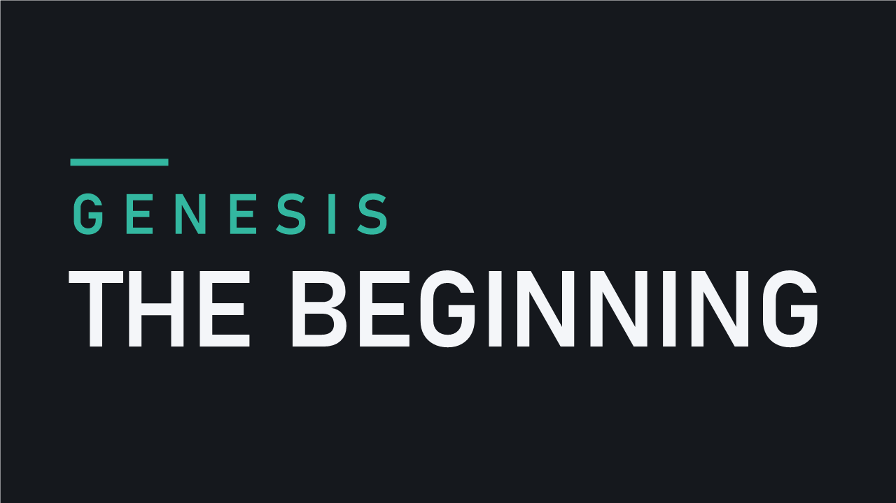

# Genesis: The Beginning

Begin with two young people, no memories, no equipment, and almost no knowledge of how to survive.

**The Beginning** is a challenging starting scenario for RimWorld 1.6, built on the Wild Men scenario from Vanilla Factions Expanded - Tribals. Your colonists arrive with nothing but one another and a small supply of scattered wood. From there, every skill, shelter, and scrap of civilization must be earned.

## The scenario

- Start with two colonists aged 18–30.
- Choose them from five generated candidates.
- Begin without equipment, supplies, or forced health conditions.
- Use the Wild Men faction, culture lock, and classic progression from VFE - Tribals.
- Face no recurring wild-person incident from the original Wild Men scenario.
- Receive 220 scattered wood near your starting location—then build your future from nothing.

Your colonists initially lack basic abilities such as sowing, doctoring, and hunting. This is an intentionally difficult start built around slow discovery and survival.

## Requirements

- RimWorld 1.6
- [Vanilla Factions Expanded - Tribals](https://steamcommunity.com/workshop/filedetails/?id=3079786283)

The rest of the Genesis Mod Pack is optional. This scenario is designed to fit alongside it, but does not require Genesis: Core.

## Playing

Subscribe on the [Steam Workshop](https://steamcommunity.com/sharedfiles/filedetails/?id=3799704955), enable this mod and VFE - Tribals, then choose **The Beginning** when starting a new colony.

Everything that will ever exist for them starts now.
